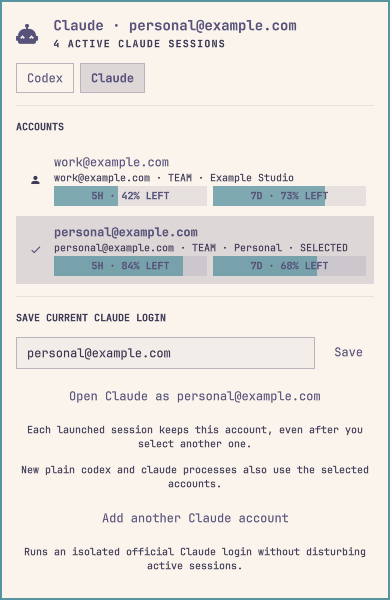

# AI Account Switcher for Omarchy

A native Omarchy Quattro bar plugin for saving and switching personal Codex CLI
and Claude Code accounts.



## Features

- Separate Codex and Claude account lists in one compact menubar panel.
- Shows each saved account's remaining Codex or Claude plan capacity so the
  account with the most headroom is easy to choose.
- Uses the official `codex login` and `claude auth login` flows.
- Gives every account a stable isolated `CODEX_HOME` or `CLAUDE_CONFIG_DIR`.
- Opens the selected account in a new terminal without rewriting the shared
  Codex or Claude login.
- Optionally routes ordinary `codex` and `claude` commands to the selected
  account, while honoring an explicitly set provider home.
- Lets existing sessions keep the account they started with while other
  accounts run alongside them.
- Keeps the original Claude profile's existing prompt and resume history with
  that account, while new Claude accounts retain independent histories.
- Retains credentials refreshed inside each account home and seeds Claude
  homes with existing unrelated `mcpOAuth` data.
- Keeps credential stores local with `0700` directory and `0600` file modes.

## Requirements

- Omarchy Quattro with plugin support
- `bash`, `jq`, `flock`, and `base64` (included in Omarchy's base system)
- `codex` for Codex accounts
- `claude` for Claude accounts

## Install

```bash
omarchy plugin add https://github.com/acrogenesis/omarchy-ai-account-switcher.git --enable
```

The plugin appears in the right side of the bar. Open it, select Codex or
Claude, and save the login currently active on the machine. Select any saved
account and press **Open Codex/Claude as ...** to start a terminal using that
account's isolated provider home. Selecting another account later does not
change any already-open session.

**Add another account** immediately launches the provider's official login in
an isolated temporary home; there is no pre-login confirmation prompt. After
login, the plugin promotes it to a stable private account home. No operation
requires closing active Codex or Claude sessions.

Plan usage is fetched through the installed provider CLIs when the panel opens
and cached in memory for five minutes. It is never added to the credential
stores. Accounts whose plan does not expose limits remain selectable and show
that plan usage was not reported.

Press **Make plain codex and claude commands follow selection** once to install
recoverable command routers in `~/.local/bin` plus a private mise shell-alias
fragment that keeps those routers ahead of mise-managed provider binaries.
After that, ordinary new `codex` and `claude` processes use the menubar
selection from any terminal. Processes already running—and new conversations
created inside one of those existing processes—keep the account that process
started with.

## Local data

Saved credentials are kept outside the plugin checkout:

```text
~/.config/omarchy/ai-account-switcher/
├── codex-accounts.json
├── claude-accounts.json
└── homes/
    ├── codex/ACCOUNT_ID/
    └── claude/ACCOUNT_ID/
```

If terminal command routing is enabled, an existing command at the destination
or mise fragment is preserved under `wrapper-backups/` before the switcher
installs its router and `~/.config/mise/conf.d/omarchy-ai-account-switcher.toml`.

The homes contain each account's credentials, refreshed tokens, and session
state. Common user configuration such as Codex skills/rules and Claude
settings/plugins is linked from the normal provider home when an account home
is first created. Claude homes begin with the shared credential document's
unrelated MCP OAuth entries, then refresh independently.

For Claude, the saved account whose identity matches the original
`~/.claude.json` profile continues to use the prompt history and project
transcripts already stored in `~/.claude`. Other Claude accounts keep their
own histories in their isolated homes. If an older plugin version already
created isolated history for the original account, it is merged back without
overwriting existing transcripts and retained under
`history-backups/claude/ACCOUNT_ID/` before the account is linked to the
original history.

Removing the plugin does not delete saved credentials. Delete the directory
above separately if you also want to remove the saved account copies.

## Remove

If terminal command routing is enabled, first restore the commands exactly as
they were before enabling it:

```bash
bash ~/.config/omarchy/plugins/acrogenesis.ai-account-switcher/InstallCommandWrappers.sh remove
```

Then remove the plugin:

```bash
omarchy plugin remove acrogenesis.ai-account-switcher
```

The command removes the plugin but deliberately leaves the private account
store intact. To remove those additional local copies too:

```bash
rm -r ~/.config/omarchy/ai-account-switcher
```

This does not log out Codex or Claude and does not delete their live provider
configuration.

## Security model

This plugin reads the normal Codex or Claude authentication file only when the
user explicitly saves that login. Selecting or opening a saved account does not
rewrite those shared files. Saved credentials never leave the machine, are
excluded from command and QML output, and are written under private `0700`
directories with `0600` files. Account changes are locked and atomic, and
destination symlinks are rejected. Terminal routing is installed only through
the explicit panel action; replaced commands and mise configuration are backed
up and restorable.

Review the source before installation. Omarchy plugins execute as unsandboxed
user code; marketplace validation is compatibility checking, not a security
audit.

## IPC

```bash
omarchy-shell acrogenesis.ai-account-switcher status
omarchy-shell acrogenesis.ai-account-switcher refresh
omarchy-shell acrogenesis.ai-account-switcher toggle
omarchy-shell acrogenesis.ai-account-switcher selectProvider claude
omarchy-shell acrogenesis.ai-account-switcher saveCurrent codex "Personal"
omarchy-shell acrogenesis.ai-account-switcher switchAccount claude ACCOUNT_ID
omarchy-shell acrogenesis.ai-account-switcher launchSelected claude
omarchy-shell acrogenesis.ai-account-switcher enableCommandSwitching
```

Provider values are `codex` and `claude`.

## Development

```bash
bash tests/test_accounts.sh
bash tests/test_add_codex_account.sh
bash tests/test_add_claude_account.sh
bash tests/test_launch_account.sh
bash -n ai_accounts.sh AddCodexAccount.sh AddClaudeAccount.sh LaunchAccount.sh CommandWrapper.sh InstallCommandWrappers.sh tests/*.sh
omarchy plugin validate .
```

## Design references

The per-session isolation model uses the providers' documented configuration
roots: OpenAI's [`CODEX_HOME`](https://learn.chatgpt.com/docs/config-file/environment-variables)
and Anthropic's [`CLAUDE_CONFIG_DIR`](https://code.claude.com/docs/en/env-vars),
which Anthropic explicitly supports for running multiple accounts side by side.

The Codex flow was inspired by
[Lampese/codex-switcher](https://github.com/Lampese/codex-switcher), while the
provider-separated model and Claude credential behavior were informed by
[Symbioose/claude-account-switcher](https://github.com/Symbioose/claude-account-switcher).
The implementation here is native to Omarchy and does not bundle either tool.

## License

MIT
